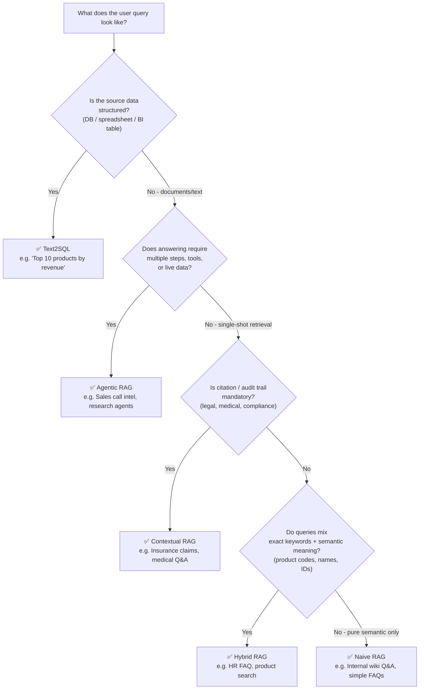

# RAG Pattern Decision Matrix
**Wohlig Internal · Pre-Sales Reference · v1.0**

---

## 1. Pattern Comparison Matrix

| RAG Pattern | Data Type | Query Type | Citation Need | Scale | Accuracy Ceiling | Cost | Complexity |
|---|---|---|---|---|---|---|---|
| **Naive RAG** | Unstructured text (PDFs, docs, wikis) | Single-hop factual lookups | Medium — chunk-level source attribution | Up to ~50k docs | ~70–75% | 🟢 Low | 🟢 Low |
| **Hybrid RAG** | Text + keyword-heavy content (product codes, IDs, names) | Semantic + exact-match mixed queries | Medium | Up to ~500k docs | ~80–85% | 🟡 Low–Med | 🟡 Medium |
| **Contextual RAG** | Long documents, legal/medical/policy text | Multi-hop, nuanced, reasoning-heavy | 🔴 High — compliance, audit trail required | Medium (~10k–100k long docs) | ~85–90% | 🟡 Medium | 🟡 Med–High |
| **Text2SQL** | Structured databases, spreadsheets, BI tables | Aggregations, trends, comparisons, "top N", "how many" | Low — result is the answer | 🟢 Very Large (billions of rows via SQL) | ~90%+ on clear schema | 🟡 Medium | 🟡 Medium |
| **Agentic RAG** | Mixed: structured + unstructured + live APIs | Multi-step reasoning, research, planning, tool-use | High | Variable | ~90%+ (with self-verification loops) | 🔴 High | 🔴 High |

---

## 2. Client Scenario → Recommended Pattern

| Client Scenario | Recommended Pattern | One-Line Reasoning |
|---|---|---|
| **Insurance Claim Assist** (e.g., HDFC, SBI Life) | Contextual RAG | Policy documents are long, queries are nuanced, and every answer needs a cited clause for regulatory compliance. |
| **Retail BI Dashboard Chatbot** (e.g., Myntra, DMart) | Text2SQL | Questions like "top 10 SKUs by revenue last quarter" are aggregations over structured sales tables — SQL is faster and more accurate than vector search. |
| **HR FAQ Bot** (e.g., internal Wohlig, Jindal HR) | Hybrid RAG | Employees search by both meaning ("leave policy") and exact keywords ("PF withdrawal Form 15G") — hybrid BM25 + vector handles both. |
| **Medical Knowledge Bot** (e.g., Apollo, Meesho Health) | Contextual RAG | Safety-critical answers require high-confidence retrieval from long clinical documents with mandatory source citation for every claim. |
| **Sales Call Intelligence** (e.g., Wohlig CRM, B2B SaaS) | Agentic RAG | Intel requires pulling from CRM records, call transcripts, competitor docs, and live web data in a coordinated multi-step reasoning loop. |

---

## 3. Decision Flowchart

---

## 4. When to Stack Patterns

**Text2SQL + RAG for Hybrid BI:** When a client needs both "how many claims were filed in Q3?" (structured → Text2SQL) and "why did claim rejections spike?" (unstructured policy/audit notes → RAG), stack both behind a single router agent that classifies the query type before dispatching — this is the exact architecture behind Wohlig's Jindal Leadership Co-Pilot.

**Hybrid RAG + Contextual for Regulated Industries:** In insurance or healthcare, use Hybrid retrieval (BM25 + vector) to maximise recall across large document corpora, then pass the top-k chunks through a reranker before generation — the hybrid layer finds the right documents, the contextual layer ensures the right passage is cited.

**Agentic + Text2SQL for Full-Stack Intelligence:** For enterprise clients who want an AI analyst (not just a chatbot), the agent orchestrates Text2SQL for quantitative questions, RAG for qualitative context, and web search for market signals — the output is a grounded narrative with numbers, sources, and trends in a single response.

---

*Built from Day 5–7 Wohlig Bootcamp work: vector search, hybrid retrieval (BM25+RRF), contextual grounding, RAG evaluation, and Text2SQL BI co-pilot patterns.*
